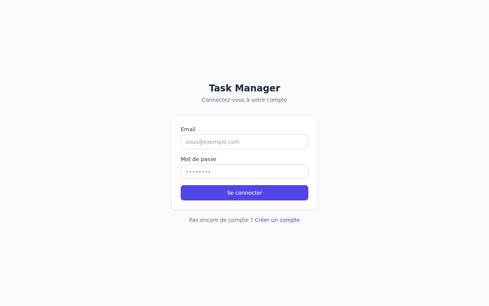
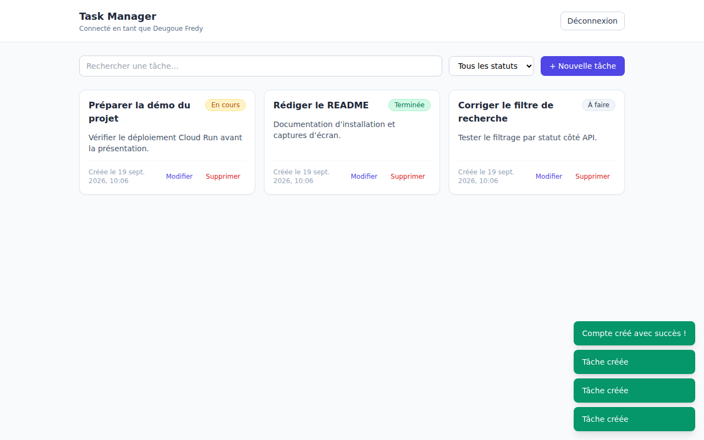

# Task Manager

Une petite app de gestion de tâches écrite pour un test technique : Spring Boot derrière, React devant.

On se crée un compte, on se connecte, on gère ses tâches (ajout, modification, suppression), avec un filtre par statut et une recherche. L'API est en JWT et chacun ne voit que ses propres tâches.

| Connexion | Liste des tâches |
|---|---|
|  |  |

## Stack

Java 21 / Spring Boot 3.3 pour l'API, avec Spring Security (jjwt), Spring Data JPA et MySQL 8.
En face : React 18 en TypeScript, Vite, Tailwind, React Router.
Et autour : Docker, GitHub Actions, déploiement sur Cloud Run.

(Le `artifactId` du pom s'appelle `kanary`, c'était le nom de travail du projet. Je l'ai laissé, ça n'a aucune importance.)

## Lancer le projet

Le plus rapide :

```bash
docker compose up --build
```

Et c'est tout : le front est sur http://localhost:3000, l'API sur http://localhost:8080, MySQL sur 3306. Comptez quelques minutes au premier build, Maven télécharge la moitié d'internet. Si le port 3306 est déjà pris par un MySQL local, changez le mapping dans `docker-compose.yml`, c'est la seule chose qui coince en général.

### Sans Docker

Il vous faut un JDK 21, Maven 3.9+, Node 20+ et un MySQL qui tourne. La base se crée toute seule au démarrage (`createDatabaseIfNotExist=true`), il n'y a que l'utilisateur à faire :

```sql
CREATE USER 'taskuser'@'%' IDENTIFIED BY 'taskpassword';
GRANT ALL PRIVILEGES ON taskmanager.* TO 'taskuser'@'%';
```

Ensuite :

```bash
cd backend && mvn spring-boot:run     # http://localhost:8080

cd frontend
cp .env.example .env                  # à éditer si l'API n'est pas sur 8080
npm install && npm run dev            # http://localhost:5173
```

Attention au port du front qui n'est pas le même selon le mode : 5173 en dev (Vite), 3000 via Docker (nginx). Les deux sont déjà dans les origines CORS autorisées.

Côté backend tout se configure par variables d'environnement, avec des valeurs par défaut qui marchent en local : `DB_HOST`, `DB_PORT`, `DB_NAME`, `DB_USER`, `DB_PASSWORD`, `JWT_SECRET`, `JWT_EXPIRATION_MS` (24h par défaut) et `CORS_ALLOWED_ORIGINS`.

Pour les tests : `cd backend && mvn verify`. Ils tournent sur H2 en mémoire, pas besoin d'avoir MySQL allumé.

## L'API

Tout ce qui est sous `/api/tasks` demande un `Authorization: Bearer <token>`.

| Méthode | Route | |
|---|---|---|
| POST | `/api/auth/register` | `{name, email, password}`, renvoie 201 + token |
| POST | `/api/auth/login` | `{email, password}`, renvoie 200 + token |
| GET | `/api/tasks` | les tâches du compte connecté. Paramètres optionnels : `status` (TODO, IN_PROGRESS, DONE) et `search`, qui cherche dans le titre et la description |
| POST | `/api/tasks` | `{title, description, status}`, renvoie 201 |
| PUT | `/api/tasks/{id}` | modifie une de ses tâches |
| DELETE | `/api/tasks/{id}` | supprime une de ses tâches, renvoie 204 |

```bash
curl -X POST http://localhost:8080/api/auth/register \
  -H "Content-Type: application/json" \
  -d '{"name":"Fredy","email":"fredy@exemple.com","password":"secret123"}'

curl -X POST http://localhost:8080/api/tasks \
  -H "Authorization: Bearer <TOKEN>" \
  -H "Content-Type: application/json" \
  -d '{"title":"Ma tâche","description":"Détails","status":"TODO"}'
```

Toutes les erreurs sortent avec la même forme, comme ça le front n'a qu'un seul cas à traiter :

```json
{ "timestamp": "2026-09-19T10:00:00", "status": 401, "message": "Email ou mot de passe incorrect" }
```

## Les choix que j'ai faits

**JWT plutôt qu'une session.** L'API ne garde rien en mémoire : `JwtAuthenticationFilter` relit le token à chaque requête, charge l'utilisateur et le pose dans le `SecurityContext`. Les mots de passe sont hachés en BCrypt.

Côté front le token est dans `localStorage`. Un cookie httpOnly aurait été plus propre, je le sais, mais avec l'API et le front sur deux domaines il fallait gérer le CORS avec credentials plus une protection CSRF, ce qui faisait beaucoup pour un projet de cette taille.

L'isolation entre comptes, elle, ne repose pas sur un `if` dans le service : elle est dans la requête SQL. Toutes les lectures filtrent sur l'id de l'utilisateur authentifié (`findByIdAndUserId`), donc une tâche qui ne vous appartient pas renvoie 404 comme si elle n'existait pas. C'est le genre de chose qu'on oublie d'écrire un jour où on est pressé, alors autant que ce soit la requête qui s'en charge. Il y a un test d'intégration là-dessus.

Pour le filtre par statut combiné à la recherche, je suis parti sur les Specifications JPA. J'avais d'abord écrit un `@Query` avec des paramètres nullables, et c'est devenu illisible dès qu'il a fallu combiner les deux critères.

Le front n'a qu'un seul point d'entrée vers l'API (`src/api/client.ts`) : il ajoute le token, transforme les erreurs du back en messages affichables, et déconnecte tout seul sur un 401. La recherche est debouncée à 300 ms, sinon c'est une requête par touche tapée.

**Docker et CI.** Images multi-stage des deux côtés : le backend finit sur un JRE Alpine en utilisateur non-root, le front est servi par nginx avec le fallback SPA. La CI construit et teste le back et le front en parallèle sur chaque push et chaque PR ; le job de déploiement, lui, ne se déclenche que sur `main`.

## Ce qui n'y est pas

Autant le dire, voilà ce que je n'ai pas fait :

- pas de refresh token, le JWT dure 24h et ensuite on se reconnecte
- `ddl-auto: update` plutôt que Flyway : ça dépanne pour une démo, ça ne tient pas en prod
- pas de pagination sur la liste des tâches (à une centaine de tâches ça ira, après il faudra)
- pas de tests côté front, les tests d'intégration du back couvrent les cas qui comptent
- le drag & drop entre colonnes façon kanban, c'était la suite logique mais hors sujet ici

## Déploiement

Le workflow déploie les deux services sur Cloud Run. Les secrets à renseigner dans *Settings > Secrets* du dépôt : `GCP_PROJECT_ID`, `GCP_SA_KEY` (compte de service avec Cloud Run Admin, Artifact Registry Writer et Service Account User), `DB_HOST`, `DB_NAME`, `DB_USER`, `DB_PASSWORD`, `JWT_SECRET`, `BACKEND_URL` et `FRONTEND_URL`.

Un piège sur lequel j'ai perdu du temps : `JWT_SECRET` doit faire au moins 32 caractères, sinon jjwt refuse la clé et l'application ne démarre pas du tout (l'erreur arrive au boot, pas à la première requête).

## Et une app mobile ?

L'API est stateless et documentée plus haut, donc une app Flutter taperait exactement les mêmes routes : login en JWT avec `dio`, token rangé dans `flutter_secure_storage`, même CRUD derrière. Comme tout passe par l'API, web et mobile restent synchronisés sans rien faire de plus.
